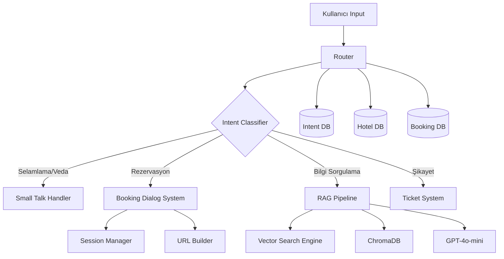
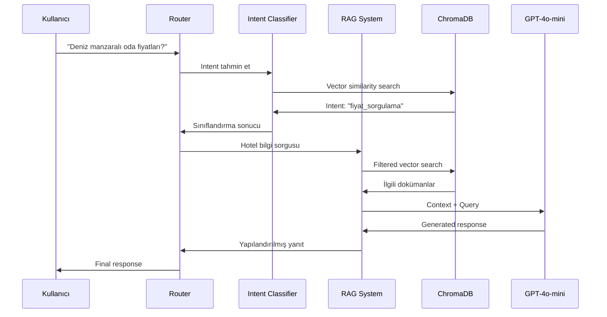

# Cullinan Belek Otel Chatbot

<div align="center">


**Gelişmiş NLP ve Vektör Arama Teknolojilerine Dayalı Akıllı Otel Asistanı**

[Özellikler](#özellikler) • [Mimari](#mimari-yapısı) • [Kurulum](#kurulum) • [Kullanım](#kullanım) • [Geliştirme](#geliştirme)

</div>

---

## Proje Genel Bakış

Bu proje, **Cullinan Belek** oteli için özel olarak geliştirilmiş çok katmanlı, akıllı chatbot sistemidir. Modern NLP teknolojilerini kullanarak misafirlere 7/24 hizmet veren, konversasyonel rezervasyon yönetimi, bilgi sorgulama ve müşteri destek hizmetleri sunan gelişmiş bir asistan sistemidir.

### Ana Hedefler

🎯 **Otomatize Müşteri Hizmetleri**: Rezervasyon süreçlerini tamamen otomatize ederek insan müdahalesini minimize etme  
🎯 **Akıllı Bilgi Erişimi**: Otel bilgilerini vektör tabanlı arama ile doğru ve hızlı şekilde sunma  
🎯 **Çok Kanallı Destek**: Intent sınıflandırması ile farklı müşteri ihtiyaçlarına özelleşmiş yanıtlar  
🎯 **Ölçeklenebilir Mimari**: Modüler yapı ile kolay genişletilebilirlik

---

## Özellikler

### 🤖 Akıllı Intent Sınıflandırması
- **Embedding Tabanlı Sınıflandırma**: OpenAI `text-embedding-3-large` modeli ile high-dimensional vektör uzayında intent tespiti
- **Çoklu Intent Desteği**: Selamlama, rezervasyon, bilgi sorgulama, şikayet gibi 10+ farklı kategori
- **Bağlamsal Anlama**: Türkçe dil işleme optimizasyonu ile doğal konuşma akışı

### 🏨 RAG (Retrieval-Augmented Generation) Sistemi
- **Hibrit Arama**: Semantic vector search + metadata filtering kombinasyonu
- **Dinamik Bağlam Oluşturma**: Query'ye en uygun bilgi parçalarını otomatik seçim
- **Filtreli Sorgulama**: Oda kapasitesi, manzara, swim-up gibi özellikler için akıllı filtreleme

### 📋 Konversasyonel Rezervasyon Sistemi
- **Çok Aşamalı Dialog Management**: State machine tabanlı rezervasyon süreci
- **Session Yönetimi**: Kullanıcı bazlı context persistence
- **Dinamik URL Oluşturma**: Otomatik rezervasyon bağlantısı üretimi
- **Veri Validasyonu**: Tarih, sayı ve format kontrolleri

### 🎫 Entegre Ticket Sistemi
- **Otomatik Ticket Oluşturma**: Şikayet ve geri bildirimlerin structured logging
- **UUID Bazlı Takip**: Benzersiz ticket numaraları ile izlenebilirlik
- **JSON Formatında Kayıt**: Analiz ve entegrasyon kolaylığı

---

## Mimari Yapısı

### High-Level Sistem Mimarisi



### Veri Akış Diagramı



### Modüler Sistem Bileşenleri

#### 🔧 Core Components

| Modül | Sorumluluk | Teknoloji Stack |
|-------|------------|----------------|
| **Router** | Ana koordinatör, intent routing | Python, ChromaDB |
| **Intent Classifier** | Kullanıcı niyeti sınıflandırma | OpenAI Embeddings, Vector DB |
| **Session Manager** | Kullanıcı state yönetimi | In-memory dataclass (Production: Redis) |
| **Config Manager** | API key yönetimi, environment config | Python os, file handling |

#### 🔗 Chain Components (Business Logic)

| Chain | İşlev | Input/Output |
|-------|--------|-------------|
| **Booking Dialog** | Rezervasyon conversation flow | User messages → Booking URL |
| **RAG Hotel** | Otel bilgileri retrieval | Natural questions → Factual answers |
| **Small Talk** | Genel konuşma yönetimi | Greetings/thanks → Templates |
| **Ticket System** | Şikayet/feedback handling | Complaints → Ticket ID |

#### 💾 Data Management Layers

```
📁 Data Architecture
├── 🗄️ Intent Database (ChromaDB)
│   ├── Collection: user_intents
│   ├── Purpose: Intent classification training data
│   └── Vectors: 1536-dim OpenAI embeddings
│
├── 🏨 Hotel Database (ChromaDB)  
│   ├── Collection: hotel_facts
│   ├── Purpose: Hotel information retrieval
│   ├── Metadata: room_type, capacity, amenities
│   └── Content: Structured hotel facts
│
└── 📋 Booking Database (ChromaDB)
    ├── Collection: booking_logs
    ├── Purpose: Reservation tracking (future use)
    └── State: Development phase
```

### Teknoloji Stack Detayları

#### 🧠 AI/ML Pipeline

- **Embedding Model**: `text-embedding-3-large` (1536 dimensions)
- **Language Model**: `gpt-4o-mini` (cost-optimized, Turkish support)
- **Vector Database**: ChromaDB (persistent storage)
- **Similarity Search**: Cosine similarity with metadata filtering
- **Retry Mechanism**: Tenacity library ile robust error handling

#### 🛠️ Development Infrastructure

- **Language**: Python 3.13+
- **Async Processing**: OpenAI client with connection pooling
- **Error Handling**: Exponential backoff, circuit breaker patterns
- **Logging**: Structured logging with rich formatting
- **Testing**: CLI interfaces for component testing

---

## Kurulum

### Sistem Gereksinimleri

- **Python**: 3.13+ (Type hints ve dataclass özellikleri için)
- **Memory**: Minimum 4GB RAM (ChromaDB ve embedding cache için)
- **Storage**: 500MB (vector databases için)
- **Network**: OpenAI API erişimi

### Hızlı Kurulum

```bash
# Repository'yi klonlayın
git clone <repository-url>
cd Chatbot

# Sanal ortam oluşturun
python -m venv venv
venv\Scripts\activate  # Windows
# source venv/bin/activate  # Linux/Mac

# Bağımlılıkları yükleyin
pip install -r requirements.txt

# OpenAI API anahtarını ayarlayın
echo "YOUR_OPENAI_API_KEY" > .openai_key
# veya
set OPENAI_API_KEY=your_api_key_here
```

### Veritabanı Hazırlığı

```bash
# Intent veritabanını oluşturun
cd cullian_intent
python build_intent_jsonl.py  # Excel'den JSONL'a dönüştürme
python ingest_intent.py       # ChromaDB'ye vector indexing

# Hotel bilgi veritabanını oluşturun  
cd ../cullian_vector
python ingest.py              # Hotel facts indexing

# Ana dizine dönün
cd ..
```

### Konfigürasyon Doğrulama

```bash
# Sistem bileşenlerini test edin
python router.py              # Interaktif chat testi
python -m cullian_rag.rag_pipeline "Otel kaç yıldızlı?"  # RAG testi
python db_test.py             # Database bağlantı testi
```

---

## Kullanım

### 🚀 Temel Kullanım

```python
from router import router

# Basit sorgu
response = router("Deniz manzaralı odalarınız var mı?")
print(response)

# Rezervasyon başlatma
response = router("Rezervasyon yapmak istiyorum")
print(response)  # Giriş tarihi sorusu

# Şikayet bildirme
response = router("Odamda sorun var")
print(response)  # Ticket oluşturma
```

### 📞 CLI Demo

```bash
# Interaktif chatbot başlatma
python router.py

# Örnek konuşma:
👤> Merhaba
🤖 Merhaba! Nasıl yardımcı olabilirim?

👤> Swim-up odalarda fiyat bilgisi
🤖 Swim-up odalarımız için güncel fiyat bilgilerimiz...

👤> 15 Temmuz için rezervasyon
🤖 Lütfen giriş tarihini (YYYY-MM-DD) girer misiniz?
👤> 2024-07-15
🤖 Çıkış tarihini (YYYY-MM-DD) yazar mısınız?
```

### 🔧 Gelişmiş Kullanım

#### RAG Sistemi Özelleştirmesi

```python
from cullian_rag.rag_pipeline import main
import sys

# Özelleştirilmiş sorgu
sys.argv = ["rag_pipeline.py", "4 kişilik swim-up oda", "--temperature", "0.1"]
main()
```

#### Intent Sistemi Yönetimi

```python
from router import predict_intent

# Intent tahmin testi
intent = predict_intent("Rezervasyon iptal etmek istiyorum")
print(f"Detected intent: {intent}")  # rezervasyon_iptali
```

### 🎯 Desteklenen Intent Kategorileri

| Intent Kategorisi | Örnek Cümleler | Handler |
|------------------|----------------|---------|
| `selamla` | "Merhaba", "Selam", "İyi günler" | Small Talk |
| `rezervasyon_oluşturma` | "Rezervasyon yap", "Oda ayırt" | Booking Dialog |
| `fiyat_sorgulama` | "Fiyatlar nedir", "Ücret bilgisi" | RAG Hotel |
| `oda_bilgisi` | "Oda özellikleri", "Spa suite" | RAG Hotel |
| `şikayet` | "Sorun var", "Memnun değilim" | Ticket System |
| `yol_tarifi` | "Nasıl gelebilirim", "Adres" | RAG Hotel |

---

## API Referansı

### Router Fonksiyonları

#### `router(query: str) -> str`
Ana routing fonksiyonu. Kullanıcı girdisini analiz ederek uygun handler'a yönlendirir.

**Parametreler:**
- `query` (str): Kullanıcı mesajı

**Dönüş:** Sistem yanıtı (str)

#### `predict_intent(query: str, k: int = 5) -> str`
Intent sınıflandırma fonksiyonu.

**Parametreler:**
- `query` (str): Sınıflandırılacak metin
- `k` (int): En yakın komşu sayısı

**Dönüş:** Intent etiketi (str)

### Booking Dialog API

#### `handle_booking_intent(user_id: str, user_msg: str) -> Tuple[str, bool]`
Rezervasyon dialog yönetimi.

**Parametreler:**
- `user_id` (str): Benzersiz kullanıcı ID'si
- `user_msg` (str): Kullanıcı mesajı

**Dönüş:** 
- `str`: Bot yanıtı
- `bool`: Dialog tamamlandı mı?

### RAG System API

#### `answer_hotel(query: str, collection, k: int = 3) -> str`
Otel bilgileri RAG sistemi.

**Parametreler:**
- `query` (str): Bilgi sorgusu
- `collection`: ChromaDB collection
- `k` (int): Döndürülecek doküman sayısı

**Dönüş:** LLM generated yanıt (str)

---

## Geliştirme

### 🏗️ Geliştirme Ortamı Kurulumu

```bash
# Development dependencies
pip install pytest black flake8 mypy

# Pre-commit hooks
pip install pre-commit
pre-commit install

# Type checking
mypy router.py chains/

# Code formatting
black . --line-length 88
flake8 . --max-line-length 88
```

### 🧪 Test Stratejisi

#### Unit Tests

```bash
# Component testleri
python -m pytest tests/test_router.py
python -m pytest tests/test_session_manager.py

# Integration testleri
python -m pytest tests/test_booking_flow.py
```

#### Manual Testing

```bash
# Intent classifier testi
python cullian_intent/db_test.py

# RAG system testi
python cullian_rag/rag_pipeline.py "Test sorusu"

# Vector database testi
python cullian_vector/query.py "Test query"
```

### 📈 Performance Monitoring

#### Vector Database Optimizasyon

```python
# Koleksiyon istatistikleri
collection = chroma.get_collection("hotel_facts")
print(f"Total documents: {collection.count()}")

# Query performance analizi
import time
start = time.time()
results = collection.query(query_texts=["test"], n_results=5)
print(f"Query time: {time.time() - start:.3f}s")
```

#### OpenAI API Monitoring

```python
# API call tracking
from tenacity import retry, wait_random_exponential

@retry(wait=wait_random_exponential(min=1, max=60))
def monitored_api_call():
    # API usage logging
    pass
```

### 🔄 Deployment Senaryoları

#### Development

```bash
# Local development server
python router.py
```

#### Staging

```bash
# Docker containerization
docker build -t cullinan-chatbot .
docker run -p 8000:8000 cullinan-chatbot
```

#### Production

```bash
# Environment variables
export OPENAI_API_KEY=prod_key
export CHROMA_PERSIST_DIR=/data/chroma_db
export LOG_LEVEL=INFO

# Production deployment
gunicorn --bind 0.0.0.0:8000 app:app
```

---

## Dosya Yapısı

```
📦 Chatbot/
├── 📄 router.py                 # Ana routing ve intent classification
├── 📄 config.py                 # API key ve configuration management
├── 📄 session_manager.py        # Kullanıcı session state yönetimi
├── 📄 main.py                   # JSON data preprocessing utilities
│
├── 🔗 chains/                   # Business logic handlers
│   ├── 📄 booking_dialog.py     # Konversasyonel rezervasyon sistemi
│   ├── 📄 booking_api.py        # Rezervasyon API integration
│   ├── 📄 booking_url.py        # Dinamik URL builder
│   ├── 📄 rag_hotel.py          # Hotel bilgileri RAG handler
│   ├── 📄 small_talk.py         # Genel konuşma template'leri
│   └── 📄 ticket_system.py      # Şikayet/feedback ticket oluşturma
│
├── 🧠 cullian_intent/           # Intent classification subsystem
│   ├── 📄 build_intent_jsonl.py # Excel to JSONL converter
│   ├── 📄 ingest_intent.py      # Intent vector database creation
│   ├── 📊 intent.xlsx           # Intent training dataset
│   └── 💾 chroma_db/            # Intent vector database
│
├── 🏨 cullian_vector/           # Hotel information subsystem  
│   ├── 📄 ingest.py             # Hotel data vector indexing
│   ├── 📄 query.py              # Vector search interface
│   ├── 📊 data1_fixed.json      # Processed hotel data
│   └── 💾 chroma_db/            # Hotel vector database
│
├── 🔍 cullian_rag/              # RAG pipeline implementation
│   ├── 📄 rag_pipeline.py       # Main RAG orchestrator
│   ├── 📄 utils.py              # RAG utility functions
│   └── 📊 logs/                 # Pipeline execution logs
│
├── 🗄️ db/                       # Centralized database storage
│   ├── 💾 intent_db/            # Production intent database
│   ├── 💾 hotel_db/             # Production hotel database
│   └── 💾 booking_db/           # Booking logs database
│
├── 🎯 cullian_finetune/         # Model fine-tuning (experimental)
│   ├── 📄 fine_tune.py          # OpenAI fine-tuning scripts
│   └── 📊 train.jsonl           # Fine-tuning dataset
│
└── 🧪 test_*.py                 # Test files ve utilities
```

---

## Katkıda Bulunma

### 🔧 Development Guidelines

#### Code Style

```python
# Type hints zorunlu
def process_query(query: str, max_results: int = 5) -> List[str]:
    pass

# Docstring formatı
def function_name(param: type) -> return_type:
    """
    Brief description.
    
    Args:
        param: Parameter description
        
    Returns:
        Return value description
        
    Raises:
        ExceptionType: Exception description
    """
```

#### Commit Message Format

```
type(scope): description

feat(router): add multi-language intent detection
fix(rag): resolve context window overflow issue  
docs(readme): update installation instructions
test(booking): add reservation flow integration tests
```

### 🐛 Issue Reporting

Issue bildirirken şunları dahil edin:
- Python version ve environment
- Error traceback (varsa)
- Reproduction steps
- Expected vs actual behavior

### 📋 Feature Requests

Yeni özellik önerileri için:
- Use case açıklaması
- Teknik gereksinimler
- Performance impact değerlendirmesi
- Backward compatibility considerations

---

## Lisans ve İletişim

### 📝 Lisans
Bu proje MIT Lisansı altında yayınlanmaktadır. Detaylar için `LICENSE` dosyasına bakınız.

### 📞 İletişim
- **Email**: development@cullinanbelek.com
- **Issue Tracker**: GitHub Issues
- **Documentation**: Wiki sayfaları

### 🙏 Teşekkürler
- OpenAI ekibi: GPT ve Embedding API'ları için
- ChromaDB geliştiricileri: Vector database technology
- Python community: Kullanılan açık kaynak kütüphaneler

---

<div align="center">

**[⬆ Başa Dön](#cullinan-belek-otel-chatbot)**

*Bu dokümantasyon sürekli güncellenmektedir. Son güncellemeler için repository'yi takip edin.*

</div>
